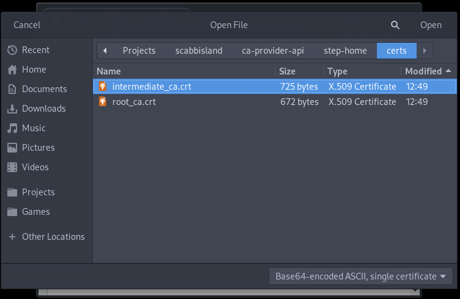
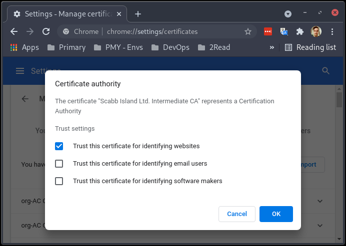
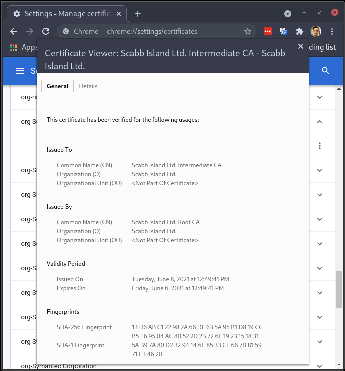

# Certificate Authority Provisioner API

Este es un proyecto basado en el producto [`step-ca`](https://smallstep.com/docs/step-ca) de la empresa 
[**_Smallstep_**](https://smallstep.com/) el cual nos permite levantar de manera simple una API de aprovisionamiento de
certificados de manera automática, compatible con él ya conocido protocolo [`ACME`](https://datatracker.ietf.org/doc/html/rfc8555)
desarrollado por la [ISRG](https://www.abetterinternet.org/).

Para poder ejecutar los artefactos generados por este proyecto, se debe tener instalado y funcionando los siguientes
componentes:
* docker >= 20.10.7
* docker-compose >= 1.29.0

> Para más información sobre como instalar y utilizar `docker` acceda al siguiente [link](https://docs.docker.com/get-started). <br/>
> Para más información sobre como instalar y utilizar `docker-compose` acceda al siguiente [link](https://docs.docker.com/compose).

## Configuración
Al estar construido sobre _docker-compose_ tenemos algunas alternativas para parametrizar la API; ya sea por variables 
de entorno, o montando directamente los archivos de configuración dentro del contenedor.

### Variables de entorno

Estas son las variables disponibles para configurar mediante _docker-compose_.

| Variable | Descripción |
|:---:|:---:|
| **STEPPATH**               |_Home_ del usuario `step` dentro del contenedor.<br/>**Default:** /home/step - **Requerido:** No|
| **CA_PROVIDER_LONG_NAME**  |Nombre de la **_CN_** del Certificado Intermedio.<br/>**Default:** 'Dummy Ltd' - **Requerido:** Si|
| **CA_PROVIDER_SHORT_NAME** |Nombre del **_PKI_** inicial.<br/>**Default:** dummy - **Requerido:** Si|
| **CA_PROVIDER_URL**        |Lista de URL(s) que se incluirán como _AltNames_ del certificado base de la API.<br/>**Default:** localhost,127.0.0.1 - **Requerido:** Si|
| **CA_PROVIDER_MAIL**       |Correo que se utilizara como referencia dentro del Certificado Intermedio.<br/>**Default:** ca@dummy.int - **Requerido:** Si|
| **CA_PROVIDER_CONFIG**     |Configuración base de la API Step.<br/>**Default:** ${STEPPATH}/config/ca.json - **Requerido:** No|
| **CA_PROVIDER_DEFAULT**    |Configuración base para el CLI Step.<br/>**Default:** ${STEPPATH}/config/defaults.json - **Requerido:** No|
| **ROOT_CA_DUMMY**          |Autogenera un _RootCA_ y su _Key_. Esta funcionalidad es meramente para desarrollo.<br/>**Default:** false - **Requerido:** No<sup>2</sup>|
| **ROOT_CA_PATH**           |Directorio en donde se buscarán/crearán los certificados dentro del contenedor.<br/>**Default:** /certs - **Requerido:** No|
| **ROOT_CA_PASS**           |Archivo de _passphrase_ para utilizar la _Key_ de la _RootCA_.<br/>**Default:** ${ROOT_CA_PATH}/rootca.pass - **Requerido:** Si<sup>1,2</sup>|
| **ROOT_CA_CERT**           |Archivo de la _RootCA_.<br/>**Default:** ${ROOT_CA_PATH}/rootca.crt - **Requerido:** Si<sup>1,2</sup>|
| **ROOT_CA_KEY**            |Archivo de la _Key_ perteneciente a la _RootCA_<br/>**Default:** ${ROOT_CA_PATH}/rootca.key - **Requerido:** Si<sup>1,2</sup>|
| **MAX_CERT_DURATION**      |Duración máxima de un certificado emitido por el API (~3 años)<br/>**Default:** 26280h - **Requerido:** No|
| **DEFAULT_CERT_DURATION**  |Duración default de un certificado emitido por el API (~3 meses)<br/>**Default:** 2160h - **Requerido:** No|
| **CI_DEBUG_TRACE**         |Setea el contenedor en modo **DEBUG**<br/>**Default:** false - **Requerido:** No|

> **1:** Solo debe configurarse en caso de proveer un RootCA.crt y un RootCA.key propio.<br/>
> **2:** En caso de configurar la variable **ROOT_CA_DUMMY** en _true_, no configurar las variables **ROOT_CA_PASS**,
> **ROOT_CA_CERT**, **ROOT_CA_KEY**, ya que los mismos se autogeneraran al momento de realizar la inicialización.

### Archivos de configuración `.env`

Otra forma de configurar las _variables de entorno_ es mediante el file `.env` el cual se importa automáticamente en el
_scope_ del _docker-compose_ y alimenta con los valores declarados en él, cualquier referencia en el `docker-compose.yaml`.

El archivo `.env` se conforma de líneas del tipo _CLAVE=VALOR_, en donde el campo clave siempre debe estar en _upper case_
y al moment de definir un valor, no debe haber espacios a los lados del Carácter **=**.

Ej:
```bash
cat .env

STEP_CA_VERSION=master
LOCA_CA_PATH=/opt/ca-provider-api/ca-cert
CA_PROVIDER_LONG_NAME="Scabb Island"
CA_PROVIDER_SHORT_NAME=scbbi
CA_PROVIDER_URL="ca.scabb-island.com.ar"
CA_PROVIDER_MAIL="acme@scabb-island.com.ar"
ROOT_CA_PASS=/certs/root_ca.pass
ROOT_CA_CERT=/certs/root_ca.crt
ROOT_CA_KEY=/certs/root_ca.key
```

Este tipo de configuración es muy útil para ambientes **productivos**, ya que la configuración no queda definida
explícitamente en el archivo `docker-compose.yaml`.

### Avanzada

Una vez [inicializada la API](#inicializar-la-api), dentro del directorio `step-home` se podrá ver que se generaron
múltiples directorios y archivos, los cuales nos servirán para hacer una configuración más avanzada a la del alcance 
de este proyecto.

Para más información sobre esta configuración, acceda al siguiente [link](https://smallstep.com/docs/step-ca/getting-started).

## Puesta en marcha

Para comenzar a utilizar la API, en caso de arrancarla por primera vez, lo que se debe hacer es inicializarla para que
la misma genere todos los archivos de configuración y el certificado intermedio para su funcionamiento.

### Inicialización

Para inicializar por primera vez la API, se debe ejecutar el comando `docker-compose run ca-provisioner` en el _root_
del proyecto. Esto tomará como predeterminado al archivo `docker-compose.yaml` el cual está preparado con los valores
para producción.

> Estos valores esperan que exista el archivo `.env` para definir los valores de los nombres de la RootCA crt/Key y su pass.

Al momento de ejecutar este comando, se nos solicitará que **por única vez**, ingresemos a mano la _passphrase_ para de la 
_key_ del _RootCA_ que estemos utilizando.

```bash
❯ docker-compose run ca-provisioner
Creating ca-provisioner-api_ca-provisioner_run ... done
2021/06/04 21:11:00 [ROOTCACHK] [INFO]  RootCA (crt)  validation: OK [/certs/root_ca.crt]
2021/06/04 21:11:00 [ROOTCACHK] [INFO]  RootCA (key)  validation: OK [/certs/root_ca.key]
2021/06/04 21:11:00 [ROOTCACHK] [INFO]  RootCA (pass) validation: OK [/certs/root_ca.pass]
Please enter the password to decrypt /certs/root_ca.key: <ESCRIBIR_ROOTCA_PASSPHRASE>

2021/06/04 21:11:03 [STEPINIT]  [INFO]

✔ Root certificate: /home/step/certs/root_ca.crt
✔ Root private key: /home/step/secrets/root_ca_key
✔ Root fingerprint: a715f7922e78cfe579f250c093ead87949f722bd61b2b4ed03b315cfdfa5be95
✔ Intermediate certificate: /home/step/certs/intermediate_ca.crt
✔ Intermediate private key: /home/step/secrets/intermediate_ca_key
2021/06/04 21:11:03 [STEPINIT]  [INFO]  Copying root certificate...
✔ Database folder: /home/step/db
✔ Default configuration: /home/step/config/defaults.json
✔ Certificate Authority configuration: /home/step/config/ca.json

Your PKI is ready to go. To generate certificates for individual services see 'step help ca'.

FEEDBACK 😍 🍻
      The step utility is not instrumented for usage statistics. It does not
      phone home. But your feedback is extremely valuable. Any information you
      can provide regarding how you’re using `step` helps. Please send us a
      sentence or two, good or bad: feedback@smallstep.com or join
      https://github.com/smallstep/certificates/discussions.
2021/06/04 21:11:03 [STEPINIT]  [INFO]  all done!
2021/06/04 21:11:03 [STEPINIT]  [INFO]
2021/06/04 21:11:03 [STEPINIT]  [INFO]  Generating intermediate certificate...
2021/06/04 21:11:03 [STEPINIT]  [INFO]  all done!
Success! Your `step-ca` config has been updated. To pick up the new configuration SIGHUP (kill -1 <pid>) or restart the step-ca process.
badger 2021/06/04 21:11:03 INFO: All 0 tables opened in 0s
2021/06/04 21:11:03 Serving HTTPS on :443 ...

[^C ^C ^C]
```
> Guardar el _fingerprint_ para poder utilizarlo luego con el `step` CLI.<br/>
> Este fingerprint también puede encontrarse posteriormente en el archivo `./step-home/config/defaults.json` en el _root_
> del proyecto, una vez concluida la inicialización.


Una vez inicializado, presionamos tres veces 'Ctrl + C', para cortar la ejecución del contenedor, y luego procedemos a 
iniciar el contenedor con normalidad en modo demonizado con el siguiente comando:

```bash
❯ docker-compopse up -d
```
Esto nos devolverá el _prompt_, una vez que el contenedor este **_Up & Running_**.

Si deseamos ver los logs de la aplicación solo basta con ejecutar el siguiente comando: `docker-compose logs -f ca-provisioner`.

Una vez terminada la inicialización, debemos resguardar los siguientes archivos:
* ./step-home/certs/intermediate_ca.crt
* ./step-home/secrets/intermediate_ca_key
* ./step-home/secrets/password

> Al momento de inicializarse, la API genera certificado intermedio basado en la RootCA que se definió, y luego utiliza
> dicho certificado intermedio para firmar los certificados posteriormente emitidos.<br/>
> **IMPORTANTE: Este _certificado intermedio_ es el que se debe distribuir a los clientes para confiar los certificados emitidos.**

## Como se utiliza

Para que los clientes confíen en los certificados emitidos por la API, lo que se debe hacer es incluir en ellos el 
_certificado intermedio_, `./step-home/certs/intermediate_ca.crt` que se generó en base al _RootCA_ al momento de la
inicialización.

A continuación, se mostrarán los métodos para configurar algunos clientes.

### Navegadores

#### Google Chrome

Como se mencionó anteriormente, lo que se debe hacer es importar el _certificado intermedio_, `./step-home/certs/intermediate_ca.crt`,
para que _Google Chrome_ confíe en los certificados emitidos por el mismo.

Para esto, lo primero que debemos hacer es acceder a la siguiente _URL_, [`chrome://settings/certificates`](chrome://settings/certificates),
desde el mismo _Google Chrome_; y una vez allí, seleccionar el _tab_ de **Authorities**


Luego hacemos _click_ en el botón **import**, y seleccionamos el archivo del _certificado intermedio_ que resguardamos
anteriormente.



Después, indicamos que este certificado solo será _confiable_ para certificados para Sitios Web

</p></div>

Y por último confirmamos que la nueva _Certificate Authority_ fue importada correctamente.




### Sistemas Operativos

#### Linux

La incorporación de un nuevo certificado en un _GNU Linux_ puede variar acorde a la distribución que se esté utilizando.
Por lo que aquí indicaremos como realizarlo en las distribuciones más comunes como: _Debian_, _RedHat_, _Ubuntu_, etc.

Lo primero que se debe hacer es copiar el _certificado intermedio_,`./step-home/certs/intermediate_ca.crt`, en alguna de
las siguientes carpetas:

* `/usr/local/share/ca-certificates/` ~> Debian/Ubunu
* `/etc/pki/ca-trust/source/anchors/` ~> RedHar/CentOS/Fedora

> Renombrar el _certificado_ con un nombre que sirva para identificarlo.

Una vez hecho esto, se le debe cambiar los permisos a `0644`

```bash
chmod 0644 <path_to_certificate>/<certificate>

# Ej:
# chmod 0644 /etc/pki/ca-trust/source/anchors/intermediate_ca.crt
```

Por último lo que se debe hacer es actualizar el único bundle de _CA Trusted_ del **OS**. Esto se hace ejecutando como
`sudo` alguna de las siguientes variantes de comandos:

* `update-ca-certificates` ~> Debian/Ubunu
* `update-ca-trust` ~> RedHar/CentOS/Fedora

---

<br/>
<br/>
<div><p align="center" valign="middle"></p></div>
<br/>
<div><p align="center" valign="middle"><strong>Powered by</strong>&nbsp;&nbsp;&nbsp;<a href="https://smallstep.com/" target="_blank"></a></p></div>
<br/>
<br/>